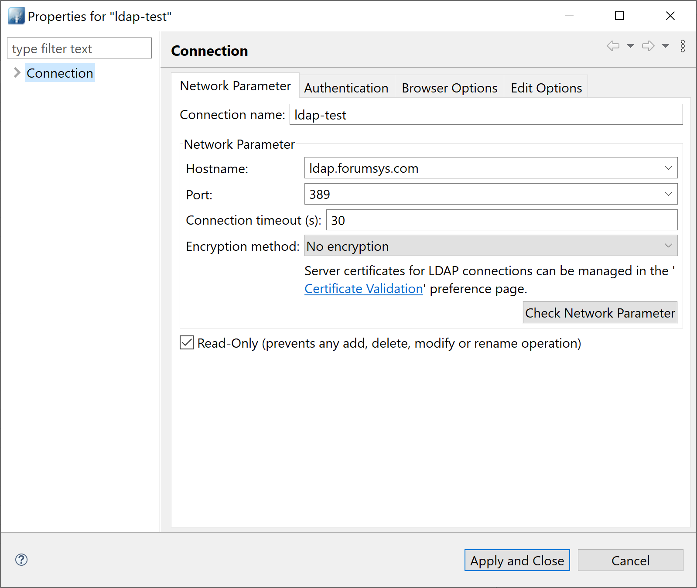

## LDAP AUTHENTICATION TEST
Simple spring-boot application to show how LDAP authentication can be used and be able to log in.

The LDAP server used is external using the following properties (application.properties):

```bash
ldap.urls=ldap://ldap.forumsys.com:389/
ldap.base.dn=dc=example,dc=com
ldap.username=cn=read-only-admin,dc=example,dc=com
ldap.password=password
ldap.user.dn.pattern=uid={0}
```

The ldap user can be connected through "Apache Directory Studio"


References for this tutorial:
https://github.com/ivangfr/springboot-ldap
https://www.forumsys.com/tutorials/integration-how-to/ldap/online-ldap-test-server/
https://springdoc.org/index.html
https://sabljakovich.medium.com/adding-basic-auth-authorization-option-to-openapi-swagger-documentation-java-spring-95abbede27e9

# Instalation
```bash
mvn spring-boot:run
``` 

# Usage
You can use tools as "Postman" to call the different endpoints or go directly to the swagger:
http://localhost:8080/swagger-ui.html

The operations are:
```bash
GET /products List all products (id,name)
GET /product/{id} Obtain a single product (if does not exist, throws an exception)
POST /products Creates a product (id,name)
``` 
The system use "Basic Authentication" 
Note: all users listed access with the password: password
